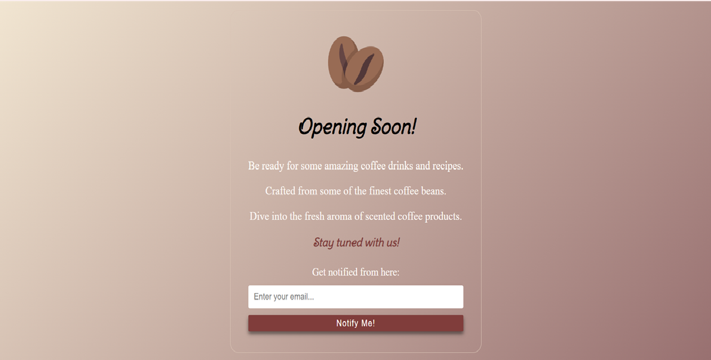

# chai-code-css

## 📝 Overview
This repo contains practice work and notes for learning **CSS** from different resources.

-----

## 📁 Table of Contents

1. [basics](./basics/) - Different ways to implement CSS into HTML.
2. [login_project](./login_project/) - A simple login page to practice CSS
3. [selectors](./selectors/) - A simple guide to CSS selectors.
4. [box_model](./box_model/) - A simple guide to CSS Box Model.
   [`box_model.md`](./box_model/box_model.md) - Short notes on box model and box-sizing properties.
   [`inline_block.md`](./box_model/inline_block.md) - Short notes on behavior of inline and block-level elements.
5. [pseudo_navbar_project](./pseudo_navbar_project/) - A small project depicting different types of navbars.
6. [opening_soon_page](./opening_soon_page/) - A simple landing page for a coming soon website.

-----

## 🏷️ Tags 

`#css` `#chai-code` `#frontend` `#learning`

-----